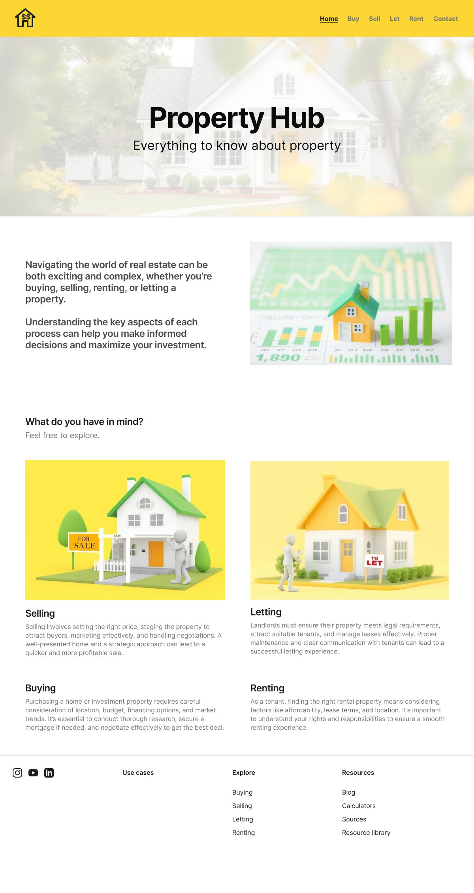

# Requirements

A website that caters to property buying, selling, letting and renting information

## Features

1. Basic information page for each
      a. Buying
      b. Selling
      c. Letting
      d. Renting

2. Cost calculators for each

3. Area stats

4. Predicted price for a postcode and house type based on previously sold property information

### Buying Calculator

** Inputs **
- House Price
- Deposit percentage/amount  
- Is it First Time Buyer/Second home/Buy to let

** Output **
- Stamp Duty
- Valuation Fee
- Surveyor fee
- Solicitor Fee
- Electronic transfer fee
- Mortgage fee (Arrangement fee, Product fee/other fees)

Total expense when buying house

Mortgage options?
Running costs?
-

See landing page designs below:

